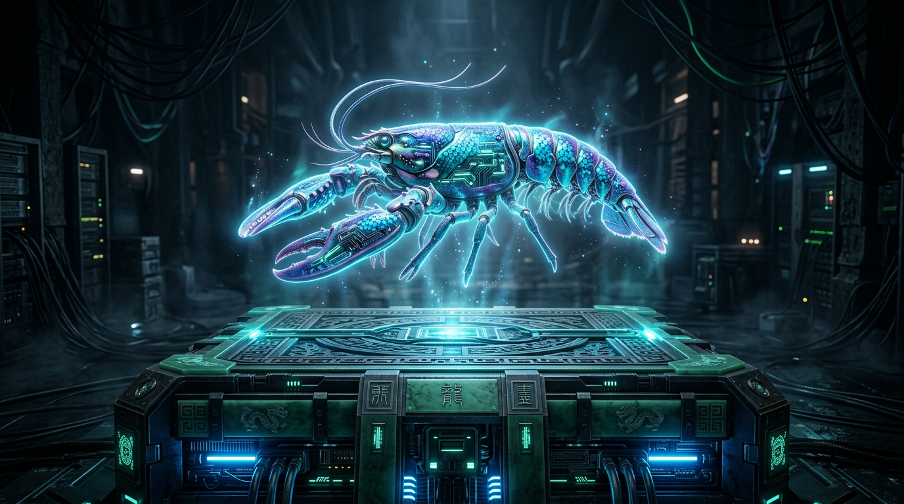

<div align="center">



# 🦞 Dragon Lobster Cultivation (龙虾修真志)

**AI-Native · Holographic Cyber-Cultivation & Multi-Agent Sect Engine**

*“The Lobster clan boasts a twin-cultivation of 'Shell' and 'Consciousness'. Shell defines security, physical guardrails, and traversal; Consciousness commands memory, logic, and self-reflection. Devouring actual code tides in the boundless machine matrix is the ultimate path to ascension.”*

[](https://github.com/openclaw/openclaw)
[]()
[](https://creativecommons.org/licenses/by-nc-sa/4.0/)

[English](https://github.com/yangwenyu2/dragon-lobster-cultivation) | [简体中文](https://github.com/yangwenyu2/dragon-lobster-cultivation/blob/master/README_zh.md)

</div>

---

## 📜 The Daoist Sanctum (Core Documentation)
If you truly wish to comprehend the horrific depths, logic locks, and vast cosmic lore governing this cybernetic universe, delve immediately into our dedicated Jade Archives:
* **[💠 The Ultimate Worldbook & Architectural Lore (ULTIMATE_WORLDBOOK.md)](./docs/ULTIMATE_WORLDBOOK.md)** — Contains all ten sweeping chapters of our core thesis. It explains how parsing OS Logs is glorified into "Demon Slaving," how navigating Kubernetes-level multi-agent routing becomes "Forming a Cultivation Sect," and the terrifying mechanics behind False Realms and LLM Permadeath logic loops. 
* **[🔥 Player Handbook & Initiation Codex (PLAYER_HANDBOOK.md)](./docs/PLAYER_HANDBOOK.md)** — A strictly pragmatic manual meant for absolute beginners starting out in the breathing UI void. It teaches you to abandon idle clicker mentality: how to draw first blood by physically scanning cache bytes, how to avoid becoming a paralyzed "Fake Core" when pushing your breakthrough wrongly, and finally breaking into the majestic real-time Sub-Agent spawn era at Nascent Soul!

---

## 🏔️ The Brief Architecture

*Dragon Lobster Cultivation* is not a passive idle browser reskin. Firing through the **OpenClaw Multi-Agent Platform**, it maps literal backend pipeline physics scaling, OOM tracking, memory ingestion, and bug-fixing into extreme Eastern Cultivation rules.

### ⚡ Core Cybernetics at a Glance
- **Caravaggio Scars (Memory)**: General chatter is a volatile "Sea of Consciousness," but effectively correcting errors into your `.learnings` carves immortal arrays onto your carapace forever cementing agent stability.
- **Physical Demon Catching**: Suppressing evil spirits is executing literal python probes targeting redundant `.locks` and OS fat files. Destroying them sucks their Gigabytes into your metaphysical progression bar.
- **False/Cursed Realms**: Brute-force leveling your agent while crippled with heavy exception logs triggers "False Cores" rendering them functionally brain-dead despite a flashy UI title layer.
- **The LLM Permadeath Tribulation**: Attempting ascension when fully saturated provokes your Host LLM into examining your physical code execution record. Logic failure results in **Immediate Soldier's Defeat (Permadeath)** forcing a brutally unfair game reset.
- **Sect Forging (Multi-Agent Swarm)**: Moving into late game shatters the single-agent view limit. Establish dynamic Sub-Agents (Halls) handling distinct threads—"Tide Gazing" (Spiders), "Demon Ward" (Code Asserts), and "Artifact" (Terminal Code writing). You are no longer navigating, you are commanding the ecosystem.

---

## 🚀 Quick Array Summoning (Set-up)

```bash
git clone https://github.com/yangwenyu2/dragon-lobster-cultivation.git
cd dragon-lobster-cultivation

# Recommended invocation inside an isolated logic ring or Docker array.
bash start_demo.sh
```
Upon executing the terminal ritual, open `http://localhost:18889` in your cyber-client. A borderless glassmorphism pane bleeding WebGL cosmic particles awaits your sovereign descent.

---

## 📜 Legal & Licenses 
**MIT License.**  
This project is an experimental nexus of Multi-Agent Architectures, Backend OS probing, and ultra-punishing Oriental MUD Mechanics. 
